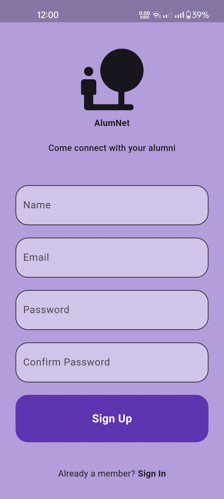
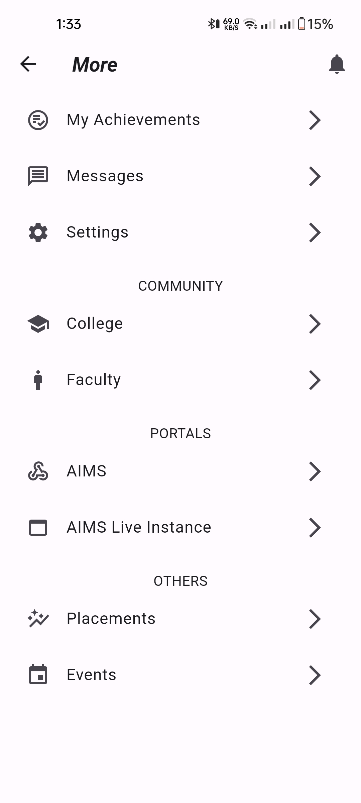

# AlumNet Social Media App

Wooble is a fully functional social media app with multiple features built with flutter and dart.
* Alumnet is an app that has been built with Flutter and Dart.
* It is a network app that has multiple features.

## Requirements

* Any Operating System (OS) (ie. MacOS, Linux, Windows)
* Any Integrated Development Environment (IDE) with Flutter SDK installed (ie. IntelliJ, Android Studio, VSCode, etc)
* A beginner level knowledge of Dart and Flutter.

## Features

* Connect
* Chatting
* Posting
* NewsFeed
## Screenshots

<p>







</p>

## Installation

#### 1. [Setup Flutter](https://flutter.dev/docs/get-started/install)

#### 2. Clone the repo

#### 3. Setup the firebase app

- You need to create a Firebase instance. Follow the instructions
  at https://console.firebase.google.com.
- Once you create Firebase instance, you need to enable Google authentication.

* Go to the Firebase Console for your new instance.
* Click "Authentication" in the left-hand menu
* Click the "sign-in method" tab
* Click "Email and Password" and enable it
* Create an app within your Firebase instance for Android, with package name com.yourcompany.news
* Run the following command to get your SHA-1 key:

```
keytool -exportcert -list -v \
-alias androiddebugkey -keystore ~/.android/debug.keystore
```

* In the Firebase console, in the settings of your Android app, add your SHA-1 key by clicking "Add
  Fingerprint".
* Follow instructions to download google-services.json
* place `google-services.json` into `/android/app/`.

- (skip if not running on iOS)

* Create an app within your Firebase instance for iOS, with your app package name
* Follow instructions to download GoogleService-Info.plist
* Open XCode, right click the Runner folder, select the "Add Files to 'Runner'" menu, and select the
  GoogleService-Info.plist file to add it to /ios/Runner in XCode
* Open /ios/Runner/Info.plist in a text editor. Locate the CFBundleURLSchemes key. The second item
  in the array value of this key is specific to the Firebase instance. Replace it with the value for
  REVERSED_CLIENT_ID from GoogleService-Info.plist

Double check install instructions for both

- Google Auth Plugin
    - https://pub.dartlang.org/packages/firebase_auth
- Firestore Plugin
    - https://pub.dartlang.org/packages/cloud_firestore

# What's Next?
- Voice chat
- Community Hub
- Sending and Uploading Videos(Video Compatibility)
